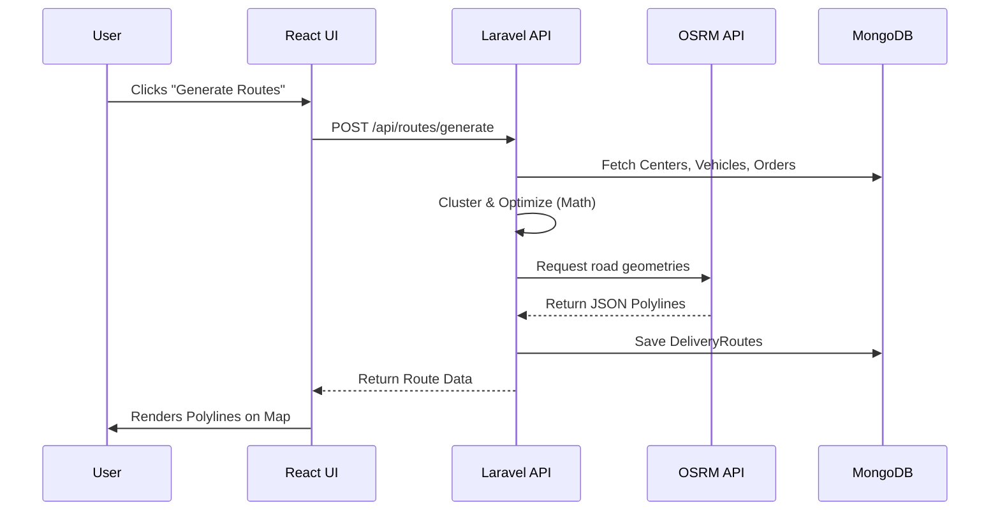

# Routiqo: Ultimate Project Deep Dive & Interview Prep Guide

Welcome to the comprehensive breakdown of your project, **Routiqo**. As a Senior Software Engineer and your interviewer coach, I've analyzed your codebase. This guide explains everything from a beginner-friendly level up to deep technical concepts. 

We will cover sections 1-8 and 10-13 here. **Once you've read this, we will begin Section 9 (Interactive Cross-Questions) in our chat.**

---

## 1. High-Level Overview

### What problem does this project solve?
In modern logistics (like Amazon, FedEx, or food delivery), the "Last Mile" is the most expensive and complex part. Dispatching drivers manually leads to overlapping routes, wasted fuel, and late deliveries. Routiqo solves this by automatically clustering orders geographically and calculating the absolute shortest path for the delivery fleet.

### Who are the users?
- **Fleet Managers / Dispatchers**: People sitting at a delivery hub using the web dashboard to monitor and assign routes.
- **Logistics Companies**: Businesses needing to streamline their delivery operations.

### Real-world use case
Imagine 500 packages arrive at a city. There are 3 delivery hubs in the city and 15 vehicles. Without Routiqo, a human has to guess which hub gets which package and which driver takes which route. **With Routiqo**, the system mathematically partitions the city, groups orders by vehicle capacity, and generates the exact driving path in seconds.

### Main features
1. **Intelligent Spatial Partitioning**: Uses "Voronoi diagrams" to divide regions so hubs don't overlap.
2. **Advanced Route Optimization**: Finds the shortest driving distance using OSRM (Open Source Routing Machine).
3. **Dynamic Hub Capture**: Hubs automatically "steal" unassigned orders near them.
4. **Smart Fleet Management**: Balances loads based on vehicle limits but has a fallback so no package is left behind.

### Why this project is valuable
It demonstrates your ability to solve complex, real-world algorithmic problems (Vehicle Routing Problem) and combine them with modern full-stack web development (React + Laravel + MongoDB + Spatial algorithms).

---

## 2. Architecture Explanation

### Explain the complete architecture in simple language
Imagine a restaurant:
- **Frontend (React)** is the waiter who takes your order and shows you the menu (Map and Dashboard).
- **Backend (Laravel)** is the kitchen manager who receives the order and coordinates the cooks.
- **Database (MongoDB)** is the pantry where all ingredients (data) are stored.
- **APIs (OSRM/Axios)** are the delivery trucks bringing in fresh ingredients from outside.

### Flow Breakdown
1. **Frontend Flow**: The user opens the React Dashboard. The `AppContext` fetches all data (Centers, Vehicles, Orders) from the Backend. The map (Leaflet) renders these points.
2. **Backend Flow**: When the user clicks "Generate Routes", the frontend sends an API request to Laravel. The `RouteController` passes the request to the `RouteService`.
3. **Database Flow**: The service queries MongoDB for pending orders and available vehicles. After calculations, it saves the generated routes and updates order statuses back in MongoDB.
4. **API Communication**: The frontend uses `axios` to talk to Laravel. Laravel uses `Http::get` to talk to the external OSRM API to get real road geometries (polylines).
5. **Authentication Flow**: Laravel Sanctum provides token-based API authentication.
6. **State Management Flow**: React uses the Context API (`AppContext.jsx`) to hold a global state, avoiding "prop drilling" (passing data down through 10 layers of components).
7. **Deployment Architecture**: (Assumed typical setup) React builds into static files hosted on Vercel/Netlify or served by Nginx. Laravel runs on a PHP-FPM server. MongoDB is hosted on MongoDB Atlas.

---

## 3. Folder Structure Deep Dive

Your workspace (`d:\projects\Routiqo`) is split into micro-frontend and backend repositories.

### Important Folders & Files
*   **`/Backend`**: The Laravel application.
    *   `/app/Models`: Contains database schemas (`Order.php`, `Vehicle.php`). *Why?* To represent data structures.
    *   `/app/Http/Controllers/Api`: Contains the entry points for frontend requests (e.g., `RouteController.php`). *Why?* To parse incoming requests and return JSON.
    *   `/app/Services`: The "Brain" of the backend (e.g., `RouteService.php`). *Why?* To keep business logic separate from controllers (a senior engineering practice).
    *   `/routes/api.php`: The map of all backend URLs.
*   **`/Dashboard`**: The React application.
    *   `/src/main.jsx` & `App.jsx`: Entry points for the UI.
    *   `/src/context/AppContext.jsx`: The global brain of the frontend state.
    *   `/src/components/Map`: Contains Leaflet map logic.
*   **`/Landing`**: A separate React app just for marketing.

---

## 4. Frontend Deep Dive (React 19)

### Routing & State Management
- You are using standard React patterns. The true magic is in `AppContext.jsx`. 
- **Why Context over Redux?** For a dashboard of this size, Redux is boilerplate-heavy. Context API combined with custom hooks provides clean, native state management.

### Map & UI Decisions
- **Leaflet & React-Leaflet**: Used instead of Google Maps to avoid API costs and provide deep customization.
- **d3-delaunay**: Used to draw Voronoi polygons (service zones) on the map natively on the frontend based on hub coordinates.
- **Tailwind CSS**: Utility-first CSS for rapid, responsive design without leaving the JSX file.

### API Integration & Optimization
- `axios` is used to call the Laravel API.
- **Performance**: Rendering thousands of map markers can crash a browser. React-Leaflet handles DOM nodes, but if scaled, you would need to implement Marker Clustering. 

---

## 5. Backend Deep Dive (Laravel 11)

### Services & Controllers
You are using a **Service-Oriented Architecture (SOA)**. 
- Controllers just receive requests and return responses.
- `RouteService.php` does the heavy lifting: clustering orders, checking capacities, calling OSRM, and saving routes. This keeps your code modular and testable.

### Algorithm & Optimization (`RouteService.php`)
This is the most critical file. 
1. **Spatial Filtering**: It filters orders within a 10km radius of a hub.
2. **Hub Stealing**: `captureNearbyOrders()` dynamically reassigns orphaned orders to the nearest hub.
3. **Clustering**: Groups orders by priority, then radially (using `atan2` angle calculation) to group orders in the same direction.
4. **Routing**: Calls an optimizer (Traveling Salesperson Problem approach) to order the stops, then fetches the actual road geometry from OSRM.

### Database Models & MongoDB
You chose MongoDB (`jenssegers/mongodb` or `mongodb/laravel-mongodb`). 
- **Why NoSQL?** Geospatial data (like large arrays of Lat/Lng points for route polylines) and flexible order schemas fit perfectly into JSON-like documents.

---

## 6. Database Deep Dive

### Collections (Tables)
1.  **Users**: Dispatchers/Admins.
2.  **DeliveryCenters**: The physical hubs (Lat/Lng).
3.  **Vehicles**: Delivery vans (Capacity, Average Speed).
4.  **Orders**: The packages (Lat/Lng, Priority, Status).
5.  **DeliveryRoutes**: The optimized paths (Total distance, geometry).
6.  **RouteStops**: Individual steps in a route.

### Relationships
- A `DeliveryCenter` has many `Vehicles` and `Orders`.
- A `DeliveryRoute` has many `RouteStops`.
- A `RouteStop` belongs to one `Order`.
*(Note: In MongoDB, you can either embed these or reference them. You are using references like a relational DB, which is fine with Laravel's Eloquent ORM).*

---

## 7. Feature-by-Feature Explanation

### Feature: Intelligent Spatial Partitioning
- **Purpose**: To divide the city fairly among hubs.
- **How it works**: Uses Voronoi diagrams (via `d3-delaunay`). Given a set of points (hubs), it draws boundaries where every location inside a polygon is closest to that hub.

### Feature: Dynamic Hub Capture (Order Stealing)
- **Purpose**: Prevent packages from being stranded.
- **How it works**: Before route generation, `RouteService::captureNearbyOrders()` scans for unassigned orders. If a hub finds an order within 10km, it changes the `delivery_center_id` to itself.

### Feature: Route Optimization
- **Purpose**: Give the driver the shortest path.
- **How it works**: Uses Nearest Neighbor or a similar heuristic in `RouteOptimizer` to sort the stops. Then it queries OSRM (`router.project-osrm.org`) to get the actual road distance and polyline drawing.

---

## 8. Interview Preparation Section

### HR / Non-Technical Explanation
"I built Routiqo, a web platform that helps delivery companies save time and fuel. It takes hundreds of unorganized orders and automatically creates the most efficient driving routes for their delivery vans. It turns hours of manual dispatching into a 1-second automated process."

### 1-Minute Technical Explanation
"Routiqo is a full-stack logistics platform built with React and Laravel, backed by MongoDB. It solves the Last Mile Delivery problem. The frontend uses Leaflet and D3 for real-time map visualization and spatial partitioning. The backend acts as an algorithmic engine—when a dispatcher requests routes, my Laravel service clusters orders using radial sorting, optimizes the sequence to minimize distance, and integrates with the OSRM API to generate accurate road geometries and ETAs."

### "Why did you choose this stack?"
"I chose **React** for the frontend because a map-heavy dashboard requires complex, reactive state management, which React's Context API handles beautifully. I chose **Laravel** for the backend because its Service Container and Eloquent ORM allowed me to cleanly abstract complex routing algorithms away from controllers. I chose **MongoDB** because storing heavy geospatial data and complex polylines is much more efficient in a document store than a relational database."

### "Biggest challenge?"
"The biggest challenge was the algorithmic complexity of the Vehicle Routing Problem. Initially, assigning orders to vehicles caused overlapping routes. I solved this by implementing radial clustering (using trigonometry `atan2`) to group orders by geographic angle before optimizing the route. I also had to handle rate-limiting and parsing from the external OSRM API."

### "What algorithm did you implement to find the shortest path and generate routes?"
"I implemented a two-phase heuristic algorithm to solve the Vehicle Routing Problem. For the first phase (Construction), I used the **Nearest Neighbor algorithm** to generate the initial route by greedily picking the closest unvisited stop. For the second phase (Improvement), I used the **2-opt algorithm** to optimize the route by systematically swapping intersecting edges to untangle the path and reduce the total distance."

---

## 9. Common Interview Cross-Questions & Answers

**Q: How do you handle scalability if 10,000 orders come in during a 5-minute window?**
**A:** "Currently, the route generation makes synchronous HTTP calls to the OSRM API. At that scale, the API would time out. To fix this, I would decouple the process by implementing a message queue (like RabbitMQ or Laravel Horizon/Redis). The API would instantly return a 'Processing' status to the frontend, and the heavy algorithm and OSRM calls would run as background jobs. The frontend could then poll for updates or use WebSockets."

**Q: Why didn't you use Dijkstra's or A* algorithm?**
**A:** "Dijkstra's and A* are great for finding the shortest path between *two* specific points on a graph. However, the problem of visiting *many* points and returning to the depot is the Traveling Salesperson Problem (TSP), which is NP-Hard. Running Dijkstra's for every combination of stops would take an impossibly long time. That's why I used a heuristic approach (Nearest Neighbor + 2-opt) instead—it provides a 'good enough' path extremely quickly."

**Q: What is a Voronoi Diagram and why use it?**
**A:** "A Voronoi diagram divides a map into regions based on the distance to specific points (our delivery hubs). I used `d3-delaunay` on the frontend to draw these boundaries so that every location on the map mathematically belongs to exactly one hub. This prevents drivers from different hubs from crossing paths and delivering to the same neighborhood."

**Q: How do you ensure no order is left behind if vehicles hit their capacity limit?**
**A:** "I implemented a 'fallback' clustering logic. The system tries to divide orders equally based on the 'fair share' and vehicle capacity limits. However, I purposely relaxed the strict capacity constraint on the very last vehicle in the array. This 'last vehicle takes all' logic acts as a safety net, ensuring that every orphaned package is picked up rather than being left stranded in the system."

---

## 10. Real Engineering Understanding

### Tradeoffs of your decisions
- **MongoDB vs PostgreSQL**: You used MongoDB, which is great for flexible schemas, but PostgreSQL with PostGIS is actually the industry standard for advanced spatial querying (like native Voronoi and bounding box queries). *An interviewer will respect you if you mention PostGIS as a future improvement.*
- **Heuristics vs Exact Algorithms**: Your optimizer likely uses a heuristic (greedy algorithm / nearest neighbor). It is fast but doesn't guarantee the mathematically perfect route. In industry, tools like Google OR-Tools are used for this.

### Best Practices Used
- **Service-Oriented Architecture**: Extracting logic to `RouteService.php`.
- **Early Returns & Guard Clauses**: Your backend code exits early if data is missing, reducing nesting.
- **Transactions**: Wrapping database updates in `DB::transaction()` ensures that if route generation fails halfway, you don't end up with corrupted data.

---

## 11. Visualization & Analogies

### Request-Response Lifecycle

---

## 12. Resume Alignment

**What you can confidently claim:**
- Built a full-stack SPA using React and Laravel.
- Implemented geospatial data processing and visualization using Leaflet and D3.
- Integrated third-party routing APIs (OSRM).
- Designed a Service-Oriented backend architecture.

**What to be careful with:**
- Don't claim you "solved the Traveling Salesperson Problem". State that you implemented a "heuristic approximation for the Vehicle Routing Problem."
- If asked if it can handle 100,000 orders simultaneously, admit that scaling to that size would require moving the algorithm processing to background queues (e.g., Redis/Laravel Horizon) rather than synchronous API calls.

---

## 13. Final Revision Notes / Cheat Sheet

- **Core Algorithm**: Radial clustering (`atan2`) + Shortest Distance + OSRM mapping.
- **Frontend State**: `AppContext.jsx` wraps the app.
- **Backend Entry**: `routes/api.php` -> `RouteController` -> `RouteService`.
- **Zone Logic**: `d3-delaunay` creates Voronoi cells.
- **Hub Stealing**: Hubs claim unassigned orders within 10km radius.
- **DB**: MongoDB. Used for fast reads/writes of JSON-heavy polyline arrays.
